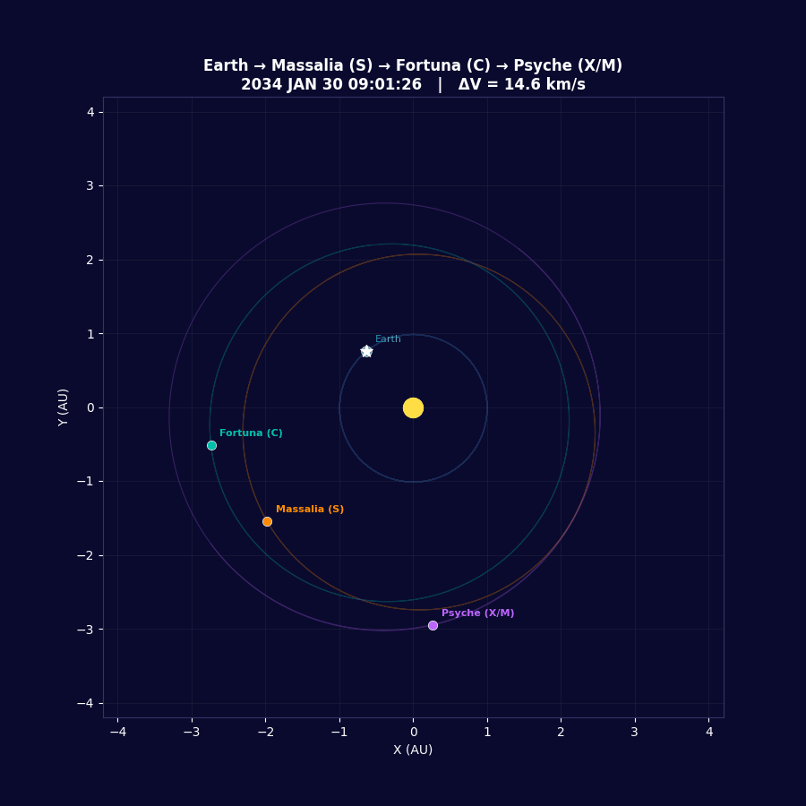

# Asteroid Selection & Trajectory Optimization Methodology

## Table of Contents

1. [Overview](#1-overview)
2. [Stage 1: Asteroid Candidate Screening](#2-stage-1-asteroid-candidate-screening)
3. [Stage 2: Multi-Criteria Tradeoff Scoring](#3-stage-2-multi-criteria-tradeoff-scoring)
4. [Stage 3: Trajectory Optimization](#4-stage-3-trajectory-optimization)
5. [Stage 4: Sequence Selection Algorithms](#5-stage-4-sequence-selection-algorithms)
6. [Implementation Details](#6-implementation-details)
7. [Results Summary](#7-results-summary)
8. [How to Run](#8-how-to-run)

---

## 1. Overview

The goal is to select three main-belt asteroids of different compositions (C-complex, S-complex, X/M-complex) and find the optimal visitation order that minimizes the total impulsive delta-V for a rendezvous mission launched from Earth.

The pipeline has four stages:

```
  SBDB Query (406 asteroids)
        |
  [Stage 1] Physical/orbital screening
        |
  [Stage 2] Multi-criteria scoring --> Top 50 candidates
        |
  [Stage 3] Lambert-based trajectory optimization (per triplet)
        |
  [Stage 4] Sequence selection (find best triplets from N asteroids)
        |
  Ranked mission candidates with delta-V, timelines, compositions
```

**Key files:**
- `Python_Consolidated/tradeoff.py` -- Stage 2 scoring
- `Python_Consolidated/optimization.py` -- Stage 3 & 4 (includes beam search, two-level, delta-v computation)
- `Python_Consolidated/core.py` -- Lambert solver (pykep), SPICE utilities, constants
- `Python_Consolidated/scripts.py` -- runner entry points
- `Python_Consolidated/visualization.py` -- trajectory animation and orbit plotting
- `Python_Consolidated/greedy.py` -- legacy greedy algorithm

---

## 2. Stage 1: Asteroid Candidate Screening

### 2.1 Data Source

The initial asteroid catalog comes from the **JPL Small Body Database (SBDB)** query saved as `sbdb_query_results.csv`. The query filters:

- Semi-major axis: 2.0 < a < 3.5 AU (main asteroid belt)
- Diameter: > 30 km (scientifically interesting, well-characterized)
- Spectral classification available (Bus-DeMeo or Tholen taxonomy)

This yields **406 candidate asteroids**.

### 2.2 Required Data per Asteroid

| Column | Description | Source |
|--------|-------------|--------|
| `full_name` | Asteroid designation and name | SBDB |
| `a`, `e`, `i` | Orbital elements (AU, dimensionless, degrees) | SBDB |
| `diameter` | Measured diameter (km), or estimated from H-magnitude | SBDB / H-mag formula |
| `spec_B`, `spec_T` | Bus-DeMeo (SMASSII) and Tholen taxonomic class | SBDB |
| `rot_per` | Rotation period (hours) | SBDB |
| `albedo` | Geometric albedo | SBDB |
| `BV` | B-V color index | SBDB |
| `H` | Absolute magnitude | SBDB |

### 2.3 Derived Quantities

**Diameter from H-magnitude** (when direct measurement unavailable):

```
D = 1329 / sqrt(p_v) * 10^(-H/5)    [km]
```

where `p_v` is the geometric albedo (default 0.15 if unknown).

**Density from taxonomy** (Carry, 2012):

| Taxonomic Group | Density (kg/m^3) | Composition |
|-----------------|-------------------|-------------|
| C, B, F, G, D, T | 1,400 | Carbonaceous (primitive) |
| S, Q, A, V, R, L, K | 2,700 | Silicaceous (stony) |
| M, X, E, P | 3,500 | Metallic / enstatite |
| Unknown | 2,000 | Conservative blend |

**Mass** = (4/3) * pi * r^3 * density

---

## 3. Stage 2: Multi-Criteria Tradeoff Scoring

Two scoring versions are implemented. **Version 3 (enhanced)** is the current default.

### 3.1 Scoring Method

Each asteroid receives a score from 1 to 10 on each criterion. Two scoring functions are available:

- **Chebyshev-spaced bins** (`cheb_score`): Boundaries at `v_min + (v_max - v_min)/2 * (1 - cos(k*pi/10))`, concentrating discrimination at distribution extremes.
- **Log-Chebyshev** (`log_cheb_score`): Same but on log10-transformed values (used for mass, radius).
- **Percentile-rank** (`pct_score`): Linear mapping of percentile rank to 1-10 (used for eccentricity, inclination, SMA, rotation, science).

### 3.2 Scoring Criteria and Weights (v3)

| Criterion | Weight | Direction | Scoring Method | Justification |
|-----------|--------|-----------|----------------|---------------|
| Delta-V accessibility | 30% | Lower is better | (from trajectory optimizer) | Dominates feasibility |
| Inclination | 20% | Lower is better | Percentile-rank | Plane changes are expensive |
| Science potential | 14% | Higher is better | Percentile-rank | Mission science value |
| Mass | 12% | Higher is better | Log-Chebyshev | Larger bodies = richer geology |
| Radius | 12% | Higher is better | Log-Chebyshev | More surface area for mapping |
| Eccentricity | 6% | Lower is better | Percentile-rank | High e increases rendezvous cost |
| Rotation period | 4% | 6-24h optimal | Percentile-rank (log-distance from 12h) | Operations constraint |
| Semi-major axis | 2% | Lower is better | Percentile-rank | Closer = shorter transfer |

### 3.3 Science Potential Score (v3)

The science score has two components:

**Component A -- Characterization depth (40%):**
- Bus-DeMeo classification known: +2 (Tholen only: +1)
- Diameter measured with sigma < 5 km: +2 (measured but imprecise: +1)
- Rotation period known: +2
- Albedo measured: +2
- B-V color index available: +1
- Max 10 points

**Component B -- Intrinsic science interest (60%):**
- Hydrated mineral signature (Ch subclass): +2
- B-type (possible organics/ice): +1
- Active main-belt comet: +3
- Surface ice detection: +3
- Ambiguous M-type (radar anomalous): +2
- Previously visited by orbit: -3 (flyby only: -1)
- Max 10 points

**Combined** = 0.40 * A + 0.60 * B

### 3.4 Output

The top 50 asteroids by weighted score are exported to `top_50_asteroids.csv` with all sub-scores. At this stage, the delta-V score is 0 because trajectory data hasn't been computed yet -- the 30% weight is effectively redistributed among the other criteria.

### 3.5 Composition Distribution in Top 50

| Class | Count | Examples |
|-------|-------|---------|
| C-complex | 37 | Themis, Fortuna, Peraga, Ceres, Doris |
| S-complex | 8 | Vesta, Massalia, Parthenope, Urania |
| X/M-complex | 5 | Psyche, Hertha, Lutetia, Beatrix, Lydia |

---

## 4. Stage 3: Trajectory Optimization

### 4.1 Problem Formulation

For a given triplet of asteroids (A1, A2, A3), find the departure/transfer/stay times that minimize total delta-V for the trajectory:

```
Earth --[leg 1]--> A1 --[stay]--> A1 --[leg 2]--> A2 --[stay]--> A2 --[leg 3]--> A3
```

**Decision variables** (6-dimensional, normalized to years):

| Variable | Meaning | Bounds |
|----------|---------|--------|
| x1 | Launch date offset from window start | [0, window_width] |
| x2 | Transfer time: Earth -> A1 | [2 weeks, 5 years] |
| x3 | Stay time at A1 | [3 months, 1 year] |
| x4 | Transfer time: A1 -> A2 | [2 weeks, 5 years] |
| x5 | Stay time at A2 | [3 months, 1 year] |
| x6 | Transfer time: A2 -> A3 | [2 weeks, 5 years] |

**Constraints:**
- Mission duration < 14 years (BSP ephemeris coverage to 2050)
- Launch window: Jan 1, 2027 - Dec 31, 2035

### 4.2 Objective Function

**Total delta-V** = sum of 6 impulsive maneuvers:

```
dV_total = |dV_launch| + |dV_A1_arrive| + |dV_A1_depart| + |dV_A2_arrive| + |dV_A2_depart| + |dV_A3_arrive|
```

Total includes Earth departure delta-V (all 6 maneuvers).

Each maneuver is the velocity difference between the Lambert transfer arc and the body's actual heliocentric velocity:

```
dV_arrive = V_lambert_arrival - V_asteroid
dV_depart = V_lambert_departure - V_asteroid
```

**Penalty handling:** Lambert solver failure returns dV = 1000 km/s. Mission duration violations also return 1000 km/s.

### 4.3 Lambert Solver

The Lambert problem is solved using **pykep** (ESA's astrodynamics library), which implements Izzo's algorithm:

```python
lp = pk.lambert_problem(r1, r2, tof, mu_sun, cw=False, max_revs=0)
V1, V2 = lp.get_v1()[0], lp.get_v2()[0]
```

- **Multi-revolution parameter (M):** For M > 0, the transfer orbit completes M full revolutions. Two branches exist per M value (left/right). M=0 is the direct (shortest) transfer.
- **Clockwise flag (cw):** Selects retrograde transfers (used for Mars flyby legs).
- **Units:** All internal computations use km, km/s (SPICE convention). pykep uses SI (m, m/s), so the wrapper converts at the boundary.

### 4.4 Optimization Algorithm

**Scipy `differential_evolution`** with L-BFGS-B polish:

```python
result = differential_evolution(
    score_paths, bounds,
    maxiter=300, tol=1e-7, seed=42,
    polish=True, updating='deferred'
)
```

Differential Evolution is a population-based global optimizer that:
1. Maintains a population of candidate solutions
2. Creates mutants by combining differences between random population members
3. Crosses over with current individuals
4. Accepts trial solutions that improve fitness
5. Finishes with L-BFGS-B gradient descent for local refinement (polish=True)

This replaced the original Chebyshev grid search (540 initial guesses + L-BFGS-B), providing better global exploration with fewer function evaluations.

**Quick variant** for coarse screening: `maxiter=30, popsize=5, polish=False` (~5-10x faster, ~10-20% less accurate).

### 4.5 Ephemeris System

| Setting | Value |
|---------|-------|
| Reference frame | ECLIPJ2000 |
| Observer (center) | Sun (NAIF ID 10) |
| Aberration correction | NONE |
| Time system | ET (seconds past J2000) |
| Planetary ephemeris | de430.bsp |
| Asteroid ephemeris | Individual BSP files (2025-2050) from JPL Horizons |
| Gravitational parameter | pykep.MU_SUN (converted to km^3/s^2) |

### 4.6 MGA-DSM Variant (Deep Space Maneuvers)

An extended 9-dimensional formulation adds mid-leg Deep Space Maneuvers:

| Additional Variables | Meaning | Bounds |
|---------------------|---------|--------|
| x7 (eta_1) | DSM timing fraction, leg 1 | [0.01, 0.99] |
| x8 (eta_2) | DSM timing fraction, leg 2 | [0.01, 0.99] |
| x9 (eta_3) | DSM timing fraction, leg 3 | [0.01, 0.99] |

Each leg is split at fraction eta:
1. Depart body on Lambert arc
2. Coast for eta * tof
3. Apply impulsive DSM (correction burn)
4. Solve Lambert from DSM point to arrival body for remaining (1-eta) * tof

This is the standard MGA-DSM formulation (Vasile & De Pascale, 2006). When eta -> 0 or 1, the DSM vanishes and the solution reduces to pure Lambert.

**Note:** This MGA-DSM formulation is not currently active in the codebase. It was an experimental addition (previously in `udp.py`) that required pygmo, which is not installed. The description is retained here for documentation purposes only.

---

## 5. Stage 4: Sequence Selection Algorithms

Given N candidate asteroids, the problem is to find the best ordered triplet (A_i, A_j, A_k) that minimizes total delta-V. Three approaches are implemented:

### 5.1 Brute Force (N^3)

Evaluate all N * (N-1) * (N-2) ordered triplets with the full optimizer.

- **Complexity:** O(N^3) full optimizations
- **For N=11:** 990 triplets -- feasible (~hours)
- **For N=50:** 117,600 triplets -- impractical with full optimizer

```python
generate_optimized_data(asteroid_list, m_1, m_2, m_3, launch_min, launch_max)
```

### 5.2 Two-Level Optimization

Coarse-filter all N^3 triplets with a fast optimizer, then fine-optimize only the top candidates.

**Pass 1 (Coarse):** Run `optimize_times_quick` (DE with maxiter=30, popsize=5) on every valid triplet. This evaluates ~100 Lambert solves per triplet instead of ~3000.

**Pass 2 (Fine):** Run full `optimize_times` (DE with maxiter=300 + polish) on the top `top_n` candidates from Pass 1.

- **Complexity:** O(N^3) quick evaluations + O(top_n) full evaluations
- **Speedup:** ~10x vs brute force for same top-k results
- **Optional science weighting:** `alpha` parameter blends delta-V and science scores: `1.0 = pure delta-V`, `0.7 = 70% dV + 30% science`

```python
two_level_optimize(asteroid_list, m_1=0, m_2=0, m_3=0,
                   launch_utc_min, launch_utc_max, top_n=15)
```

### 5.3 Beam Search

Build sequences stage-by-stage, keeping only the top-k (beam width) partial sequences at each depth.

**Stage 1:** Earth -> each of N asteroids. Optimize single-leg transfer, keep top k.

**Stage 2:** For each of k survivors, try extending to each remaining asteroid. Optimize second leg. Keep top k two-asteroid sequences.

**Stage 3:** Same process to get top k complete triplets.

- **Complexity:** O(N * k * 3) single-leg optimizations
- **For N=50, k=10:** ~1,500 leg evaluations vs 117,600 triplet evaluations
- **Science weighting:** The `alpha` parameter blends delta-V and science scores when ranking candidates.

The active implementation is in `optimization.py`:
- `optimization.beam_search(...)` -- uses DE for each leg, includes science weighting via `science_scores` and `alpha` parameters

### 5.4 Comparison of Approaches

| Method | N=15 time | N=50 time | Quality | Best for |
|--------|-----------|-----------|---------|----------|
| Brute force N^3 | ~4 min | ~hours | Optimal | Small N |
| Two-level | ~4 min | ~90 min | Near-optimal | Medium N |
| Beam search (k=10) | ~30 sec | ~5 min | Good (may miss) | Large N, quick screening |

---

## 6. Implementation Details

### 6.1 Software Dependencies

| Package | Version | Purpose |
|---------|---------|---------|
| pykep | 3.x (requires Python < 3.13) | Lambert solver, orbit propagation, flyby dV (optional -- falls back to spiceypy-only if not installed) |
| spiceypy | latest | SPICE kernel management, ephemeris queries |
| scipy | latest | `differential_evolution` optimizer |
| numpy | latest | Numerical arrays |
| pandas | latest | Tradeoff table I/O |
| matplotlib | latest | Visualization, GIF animation |

### 6.2 SPICE Kernel Setup

**Generic kernels** (required, must be in `generic_kernels/` or symlinked):

```
generic_kernels/
  lsk/naif0012.tls           -- leap seconds
  spk/planets/de430.bsp      -- planetary ephemeris
  spk/satellites/jup310.bsp  -- Jupiter satellite ephemeris
  pck/gm_de431.tpc           -- gravitational parameters
  pck/pck00010.tpc           -- planetary constants
```

**Asteroid BSP files** (in `NOTABLE_ASTEROID_BSPs/`, one per asteroid):

Downloaded from JPL Horizons API covering 2025-01-01 to 2050-01-01. NAIF IDs follow the convention `2000XXXX` where `XXXX` is the asteroid number.

```python
# Download example (from JPL Horizons API):
params = {'COMMAND': "'586'", 'EPHEM_TYPE': 'SPK',
          'START_TIME': "'2025-01-01'", 'STOP_TIME': "'2050-01-01'"}
# Response contains base64-encoded SPK in the 'spk' field
```

For "pre-computed major bodies" (Ceres, Vesta), use `'N;'` command format (trailing semicolon) to force small-body lookup.

### 6.3 Unit Conventions

| Quantity | Internal Unit | SPICE Unit | pykep Unit |
|----------|---------------|------------|------------|
| Position | km | km | m |
| Velocity | km/s | km/s | m/s |
| Time | seconds (ET) | seconds (ET) | seconds |
| Gravitational parameter | km^3/s^2 | km^3/s^2 | m^3/s^2 |
| Time of flight (Lambert) | days | -- | seconds |

Conversions happen at the `core.py` wrapper boundary: `_KM2M = 1e3`, `_M2KM = 1e-3`.

### 6.4 Key Constants

```python
MINUTE = 60
HOUR   = 3600
DAY    = 86400
WEEK   = 604800
MONTH  = 2629800      # 30.4375 days (365.25/12)
YEAR   = 31557600     # 365.25 days (Julian year)
MAX_MISSION_DURATION = 14 * YEAR  # 2035 launch + 14yr < 2050 BSP coverage
```

---

## 7. Results Summary

### 7.1 Top 15 Paths (from 50-asteroid GCP optimization)

Optimized over 117,600 valid triplets from all 50 notable asteroids using two-level optimization on Google Cloud (e2-standard-4 VM, 4 vCPU, 16 GB RAM). Coarse pass: 9 canonical Lambert evaluations per triplet (completed in 4.5 minutes). Fine pass: full differential evolution on top 50 candidates (completed in 2 minutes). **Total wall time: 6.5 minutes.**

| Rank | Path (Earth ->) | Total dV (km/s) | Launch dV (km/s) |
|------|-----------------|:---:|:---:|
| 1 | **HERTHA -> LUTETIA -> HARMONIA** | **13.07** | 6.63 |
| 2 | MISA -> MAJA -> PERAGA | 13.65 | 6.74 |
| 3 | SILESIA -> ORTRUD -> ERATO | 14.54 | 7.22 |
| 4 | ORTRUD -> ERATO -> SILESIA | 14.66 | 7.15 |
| 5 | MISA -> PALES -> ERATO | 14.79 | 6.74 |
| 6 | MISA -> MAJA -> KLYMENE | 15.03 | 6.74 |
| 7 | SILESIA -> ERATO -> ORTRUD | 15.27 | 7.22 |
| 8 | ORTRUD -> ERATO -> PALES | 15.41 | 7.15 |
| 9 | PALES -> MISA -> MAJA | 15.45 | 7.02 |
| 10 | ERATO -> ORTRUD -> PALES | 15.55 | 7.10 |
| 11 | ERATO -> MASSALIA -> MISA | 15.64 | 7.09 |
| 12 | ERATO -> ORTRUD -> SILESIA | 15.72 | 7.10 |
| 13 | PALES -> ORTRUD -> ERATO | 15.76 | 7.02 |
| 14 | SILESIA -> ERATO -> THEKLA | 15.87 | 7.22 |
| 15 | IPHIGENIA -> POLYXO -> CAMPANIA | 15.88 | 7.06 |

### 7.2 Best Overall Path (50-asteroid pool)

**Earth -> 135 Hertha (M) -> 21 Lutetia (M/X) -> 40 Harmonia (S)** — 13.07 km/s total dV:

| Event | Date | Elapsed |
|-------|------|---------|
| Earth departure | 2031 Sep 01 | 0 yr |
| Arrive 135 Hertha | 2033 Mar 07 | 1.5 yr |
| Depart Hertha | 2034 Mar 07 | 2.5 yr |
| Arrive 21 Lutetia | 2036 Feb 08 | 4.4 yr |
| Depart Lutetia | 2036 May 10 | 4.7 yr |
| Arrive 40 Harmonia | 2038 Mar 07 | 6.5 yr |

**Delta-v breakdown:**

| Maneuver | dV (km/s) |
|----------|:---------:|
| Earth departure | 6.63 |
| Hertha arrival | 3.16 |
| Hertha departure | 0.24 |
| Lutetia arrival | 1.17 |
| Lutetia departure | 0.90 |
| Harmonia arrival | 0.98 |
| **Total** | **13.07** |

**Stay durations:** 12.0 months at Hertha, 3.0 months at Lutetia.

**Why these targets:**
- **135 Hertha (M-type)**: 39 km radius, a=2.43 AU, i=2.3°. Metallic asteroid — possible exposed iron-nickel core fragment. Low inclination keeps plane-change cost minimal.
- **21 Lutetia (M/X-type)**: 49 km radius, a=2.44 AU, i=3.1°. Rosetta flyby target (2010) — surface was found to be unexpectedly non-metallic despite M-type classification, making it scientifically puzzling. A dedicated rendezvous would resolve this.
- **40 Harmonia (S-type)**: 54 km radius, a=2.27 AU, i=4.3°. Silicaceous stony asteroid. Located at a relatively low SMA (inner main belt), reducing the total transfer distance.

Trajectory animations:
- `Renders/Asteroid_Plots/10_Trajectory_2D_HERTHA_LUTETIA_HARMONIA.gif`
- `Renders/Asteroid_Plots/11_Trajectory_3D_HERTHA_LUTETIA_HARMONIA.gif`

### 7.3 Previous Results (30-asteroid subset)

The earlier 30-asteroid optimization (prior to the full 50-asteroid GCP run) found:

| Rank | Path (Earth ->) | Total dV (km/s) | Launch dV (km/s) | Compositions |
|------|-----------------|:---:|:---:|--------------|
| 1 | **Peraga -> Fortuna -> Thekla** | **13.44** | 6.09 | C -> C -> C |
| 2 | Peraga -> Fortuna -> Massalia | 13.75 | 6.09 | C -> C -> S |
| 3 | **Hertha -> Lutetia -> Erato** | **13.91** | 6.64 | M -> M -> C |
| 4 | Peraga -> Massalia -> Fortuna | 14.12 | 6.09 | C -> S -> C |
| 5 | Hertha -> Lutetia -> Polyxo | 14.17 | 6.63 | M -> M -> C |
| 6 | Hertha -> Lutetia -> Klymene | 14.30 | 6.74 | M -> M -> C |
| 7 | Hertha -> Lutetia -> Themis | 14.36 | 6.63 | M -> M -> C |
| 8 | Massalia -> Peraga -> Fortuna | 14.37 | 5.37 | S -> C -> C |
| 9 | Urania -> Aegina -> Klymene | 14.38 | 6.22 | S -> C -> C |
| 10 | Peraga -> Fortuna -> Parthenope | 14.56 | 6.09 | C -> C -> S |
| 11 | Peraga -> Pales -> Erato | 14.56 | 6.08 | C -> C -> C |
| 12 | **Massalia -> Fortuna -> Psyche** | **14.61** | 6.35 | **S -> C -> M** |
| 13 | Fortuna -> Thekla -> Erato | 14.78 | 6.71 | C -> C -> C |
| 14 | Urania -> Ate -> Isolda | 14.78 | 5.74 | S -> C -> C |
| 15 | Massalia -> Fortuna -> Thekla | 16.21 | 5.30 | S -> C -> C |

**Best path from 30-asteroid run: Earth -> Peraga (Ch) -> Fortuna (Ch) -> Thekla (Ch)** — 13.44 km/s total dV:

| Event | Date | Elapsed |
|-------|------|---------|
| Earth departure | 2029 Dec 24 | 0 |
| Arrive Peraga | 2031 Jun 19 | 1.5 yr |
| Depart Peraga | 2031 Oct 7 | 1.8 yr |
| Arrive Fortuna | 2033 Aug 26 | 3.7 yr |
| Depart Fortuna | 2033 Nov 26 | 3.9 yr |
| Arrive Thekla | 2035 Jun 20 | 5.5 yr |

Trajectory animations:
- `Renders/Asteroid_Plots/10_Best_Path_2D_Peraga-Fortuna-Thekla.gif`
- `Renders/Asteroid_Plots/11_Best_Path_3D_Peraga-Fortuna-Thekla.gif`

### 7.4 Best Compositionally Diverse Path (S + C + M, from 30-asteroid run)

The mission requires visiting one asteroid from each of the three major compositional classes (C-complex carbonaceous, S-complex silicaceous, X/M-complex metallic) for comparative planetology. The best path achieving full diversity is:

**Earth -> Massalia (S) -> Fortuna (C) -> Psyche (X/M)** — 14.61 km/s total dV:

| Event | Date | Elapsed | Body | Composition |
|-------|------|---------|------|-------------|
| Earth departure | 2034 Jan 30 | 0 | Earth | -- |
| Arrive Massalia | 2035 Jun 22 | 1.4 yr | 20 Massalia | S-type (silicaceous stony) |
| Depart Massalia | 2035 Sep 21 | 1.6 yr | | Stay: 3.0 months |
| Arrive Fortuna | 2037 Nov 16 | 3.8 yr | 19 Fortuna | Ch-type (hydrated carbonaceous) |
| Depart Fortuna | 2038 Feb 16 | 4.0 yr | | Stay: 3.0 months |
| Arrive Psyche | 2039 Sep 9 | 5.6 yr | 16 Psyche | X-type (metallic/enstatite) |

**Delta-V breakdown:**
- Launch dV (Earth departure): 6.35 km/s (C3 ~ 40 km^2/s^2)
- Spacecraft dV (5 maneuvers): 14.61 km/s
- Total mission dV: 20.96 km/s

**Why these three targets:**
- **Massalia (S)**: 67.8 km radius, a=2.41 AU, i=0.7°. One of the largest S-type asteroids. Very low inclination minimizes plane-change cost. Ordinary chondrite analogue — represents the most common inner solar system building material.
- **Fortuna (Ch)**: 100 km radius, a=2.44 AU, i=1.6°. Hydrated carbonaceous asteroid (Ch subclass indicates aqueous alteration). Science interest: water-bearing minerals from early solar system processing.
- **Psyche (X/M)**: 111 km radius, a=2.92 AU, i=3.1°. The target of NASA's Psyche mission (launched 2023). Believed to be an exposed planetary core — metallic iron-nickel. Visiting after the NASA mission provides complementary in-situ data.

**Trajectory animations:**
- `Renders/Asteroid_Plots/12_Diverse_Path_2D_Massalia-Fortuna-Psyche.gif`
- `Renders/Asteroid_Plots/13_Diverse_Path_3D_Massalia-Fortuna-Psyche.gif`



### 7.5 Composition Analysis

The top 15 paths show clear patterns:

| Pattern | Count | Best dV | Example |
|---------|-------|---------|---------|
| C -> C -> C | 4 | 13.44 | Peraga -> Fortuna -> Thekla |
| M -> M -> C | 4 | 13.91 | Hertha -> Lutetia -> Erato |
| C -> C -> S | 2 | 13.75 | Peraga -> Fortuna -> Massalia |
| S -> C -> C | 2 | 14.37 | Massalia -> Peraga -> Fortuna |
| C -> S -> C | 1 | 14.12 | Peraga -> Massalia -> Fortuna |
| **S -> C -> M** | **1** | **14.61** | **Massalia -> Fortuna -> Psyche** |
| S -> C -> C | 1 | 16.21 | Massalia -> Fortuna -> Thekla |

The delta-V penalty for compositional diversity (S+C+M) over the pure-minimum (C+C+C) is only **1.17 km/s** (14.61 vs 13.44), a modest 8.7% increase that is well worth the scientific return of visiting all three asteroid classes.

### 7.6 Compute Infrastructure

The 50-asteroid optimization was run on **Google Cloud Platform** Compute Engine:

| Parameter | Value |
|-----------|-------|
| VM type | e2-standard-4 (4 vCPU, 16 GB RAM) |
| OS | Debian 12 |
| Python | 3.11 (Miniconda) |
| pykep | 2.6 (conda-forge) |
| Region | us-west1-b |
| Total wall time | 6.5 minutes |
| Total cost | ~$0.08 |

**Two-level optimization performance:**

| Phase | Triplets | Method | Time |
|-------|----------|--------|------|
| Coarse screening | 117,600 | 9 canonical Lambert samples per triplet | 4.5 min |
| Fine optimization | 50 | Full differential_evolution (maxiter=300, polish=True) | 2.0 min |

The coarse screening evaluates 9 fixed time-of-flight configurations (3 launch dates x 3 transfer durations) per triplet, each requiring 3 Lambert solves = 27 Lambert solves per triplet. This is ~30x faster than the previous approach (differential evolution with maxiter=30 per triplet) while providing sufficient discrimination to identify the top candidates.

---

## 8. How to Run

All commands assume the working directory is the repository root.

### 8.1 Setup

```bash
# Install dependencies
pip install numpy scipy spiceypy matplotlib tqdm pandas imageio
pip install pykep  # optional, requires Python < 3.13

# Ensure generic SPICE kernels are linked
ln -sf /path/to/generic_kernels ./generic_kernels

# Asteroid BSP files should be in NOTABLE_ASTEROID_BSPs/
ls NOTABLE_ASTEROID_BSPs/*.bsp | wc -l   # should be 50
```

### 8.2 Run Tradeoff Scoring

```python
import sys; sys.path.insert(0, 'Python_Consolidated')
from tradeoff import run_tradeoff_v3
run_tradeoff_v3('sbdb_query_results.csv', 'asteroid_tradeoff.csv')
```

### 8.3 Run Two-Level Optimization (Recommended)

```python
import sys; sys.path.insert(0, 'Python_Consolidated')
from core import load_kernels
from optimization import two_level_optimize

asteroid_list = load_kernels('NOTABLE_ASTEROID_BSPs', 'generic_kernels')

# Filter to top N by name if desired
top_names = ['THEMIS', 'THEKLA', 'FORTUNA', 'PERAGA', ...]
subset = [a for a in asteroid_list if a['NAME'] in top_names]

results = two_level_optimize(
    subset, m_1=0, m_2=0, m_3=0,
    launch_utc_min='Jan 1 12:00:00 UTC 2027',
    launch_utc_max='Dec 31 12:00:00 UTC 2035',
    top_n=15
)
```

### 8.4 Run Beam Search

```python
from optimization import beam_search

results = beam_search(
    asteroid_list,
    launch_utc_min='Jan 1 12:00:00 UTC 2027',
    launch_utc_max='Dec 31 12:00:00 UTC 2035',
    beam_width=15,
    science_scores=science_scores,  # dict of asteroid name -> score
    alpha=0.7                       # 70% dV + 30% science
)
```

### 8.5 Run Brute Force (Small N only)

```python
from optimization import generate_optimized_data

data = generate_optimized_data(
    asteroid_list, 0, 0, 0,
    'Jan 1 12:00:00 UTC 2027', 'Dec 31 12:00:00 UTC 2035'
)
```

### 8.6 Using Script Entry Points

```python
from scripts import run_two_level_optimize, run_beam_search

results = run_two_level_optimize()
# or
results = run_beam_search(beam_width=15)
```

---

## References

- Carry, B. (2012). "Density of asteroids." *Planetary & Space Science*, 73, 98-118.
- DeMeo, F.E. et al. (2009). "An extension of the Bus asteroid taxonomy." *Icarus*, 202, 160-180.
- Izzo, D. (2015). "Revisiting Lambert's problem." *Celestial Mechanics & Dynamical Astronomy*, 121(1):1-15.
- Storn, R. & Price, K. (1997). "Differential Evolution." *J. Global Optimization*, 11:341-359.
- Taylor, C.R. et al. (2018). "A Delta-V map of the known Main Belt Asteroids." *Acta Astronautica*, 146, 73-82.
- Vasile, M. & De Pascale, P. (2006). "On the Preliminary Design of MGA Trajectories." *JGCD*, 29(6):1347-1361.
- Wales, D.J. & Doye, J.P.K. (1997). "Global Optimization by Basin-Hopping." *J. Phys. Chem. A*, 101(28):5111-5116.
- pykep: https://esa.github.io/pykep/
- pagmo: https://esa.github.io/pagmo2/
- SPICE/NAIF: https://naif.jpl.nasa.gov/naif/
